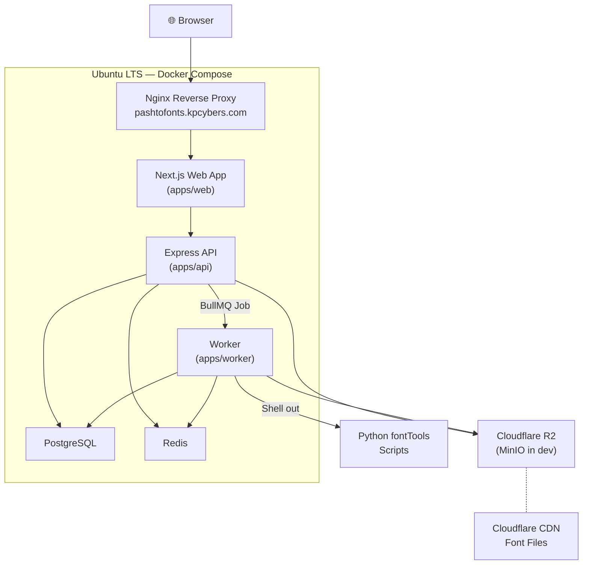

# Pashto Fonts — Implementation Plan

A Google Fonts-inspired RTL font discovery, preview, download, and web-font hosting platform focused on Pashto and Arabic-script languages.

---

## Project Summary

Build a production-grade monorepo application with:
- **Frontend** (Next.js + React + TypeScript + **Vanilla CSS**) — public browsing, previewing, and admin UI with full centralized theme control
- **Backend** (Node.js + **Express.js** + TypeScript + Prisma) — REST API, auth, uploads, CSS endpoint
- **Worker** (Node.js + TypeScript + Python fontTools) — font processing, WOFF2 conversion, glyph detection
- **Infrastructure** — PostgreSQL, Redis, MinIO (local S3) → **Cloudflare R2** (production), Docker Compose, Nginx

---

## Decisions Confirmed

| Decision | Choice |
|----------|--------|
| CSS Framework | **Vanilla CSS** with centralized theme/design tokens |
| Backend Framework | **Express.js** |
| Object Storage | **Cloudflare R2** (production), MinIO (local dev) |
| Domain | `pashtofonts.kpcybers.com` initially → `pashtofonts.com` later |
| Deployment | **Ubuntu LTS + Docker** (self-hosted) |
| Font Collection | **70+ real Pashto TTF fonts** available for testing |
| License Management | **Not needed** — all fonts are open source |

---

## Proposed Changes — Phase-by-Phase Build

The project is divided into **11 phases**, built incrementally. Each phase produces a testable, working increment.

> [!NOTE]
> **Simplifications from original reference doc:**
> - Removed all `LicenseStatus` enum logic, license-blocking checks, and license-gating from downloads/CSS endpoint/public API
> - Removed license status UI from admin panel
> - All uploaded fonts are treated as open-source and freely distributable
> - Fonts still go through DRAFT → PUBLISHED flow so admin can review before publishing

---

### Phase 0 — Project Setup (Monorepo Foundation)

Set up the entire project skeleton with working local dev environment.

#### [NEW] Root config files
- `package.json` (workspace root with npm workspaces)
- `tsconfig.base.json` (base TypeScript config)
- `.env.example`
- `.gitignore`
- `README.md`
- `docker-compose.yml` (PostgreSQL, Redis, MinIO)

#### [NEW] `apps/web/` — Next.js Frontend
- Initialize Next.js 14+ with TypeScript (no Tailwind)
- App Router structure under `app/`
- Centralized Vanilla CSS design system (`styles/theme.css`, `styles/globals.css`, `styles/reset.css`)
- CSS custom properties for colors, spacing, typography, shadows, radii
- Basic layout with RTL support
- Health/landing page

#### [NEW] `apps/api/` — Express Backend
- Express + TypeScript setup
- `GET /api/health` endpoint
- Prisma client initialization
- Redis client initialization
- Environment config loader (Zod-validated)

#### [NEW] `apps/worker/` — Background Worker
- Basic BullMQ worker skeleton
- Health check
- Connection to Redis

#### [NEW] `packages/shared/` — Shared Types
- Shared TypeScript types and interfaces
- API response shapes
- Enum definitions

**Acceptance**: `docker-compose up` starts all services, web app opens, API health endpoint responds, DB and Redis connect.

---

### Phase 1 — Database & Core API

#### [NEW] `apps/api/prisma/schema.prisma`
Full Prisma schema with models: `Admin`, `Font`, `FontFile`, `Category`, `FontTag`, `FontAnalytics` and enums (`FontStatus`, `FontStyle`, `FontFormat`, `AnalyticsEvent`, `AdminRole`).

> [!NOTE]
> `LicenseStatus` enum and all license fields (`license`, `licenseUrl`, `licenseStatus`) are **removed** from the schema. A simple `license` text field defaults to `"Open Source"` for attribution display only.

#### [NEW] `apps/api/prisma/seed.ts`
Seed script with default categories: Naskh, Nastaliq, Kufi, Modern, Sans, Serif, Calligraphy, Display, News, UI.

#### [NEW] `apps/api/src/modules/fonts/`
- `fonts.router.ts` — `GET /api/fonts`, `GET /api/fonts/:slug`
- `fonts.service.ts` — Business logic with pagination, search, filtering, sorting
- `fonts.schema.ts` — Zod validation for query params
- Only return fonts with status `PUBLISHED` (no license checks needed)

#### [NEW] `apps/api/src/modules/categories/`
- `categories.router.ts` — `GET /api/categories`, `GET /api/categories/:slug`
- `categories.service.ts`

**Acceptance**: Seeded categories exist, public API returns paginated fonts, filters/search work.

---

### Phase 2 — Public Frontend (Browsing UI)

#### [NEW] `apps/web/styles/` — Centralized CSS Design System
- `theme.css` — CSS custom properties (colors, typography, spacing, shadows, radii, breakpoints)
- `reset.css` — CSS reset/normalize
- `globals.css` — Global styles, RTL defaults, base typography
- `components/` — Per-component CSS modules (e.g., `font-card.module.css`, `preview-controls.module.css`)

#### [NEW] `apps/web/app/page.tsx` — Homepage
- Hero section with Pashto preview input
- Featured fonts section
- Popular fonts section
- Categories grid
- Developer embed CTA

#### [NEW] `apps/web/app/fonts/page.tsx` — Fonts Browsing Page
- Global Pashto preview text input
- Font size slider, weight selector
- Category/language filters
- Search input, sort dropdown
- Responsive font card grid

#### [NEW] `apps/web/components/FontCard.tsx`
- Font name, category badge, preview text (RTL)
- Available weights, language badges
- Download / View / Copy CSS buttons
- Intersection Observer for lazy font loading (WOFF2 only when card enters viewport)

#### [NEW] `apps/web/hooks/usePreviewState.ts`
- Zustand store for global preview text, size, weight, alignment

#### [NEW] `apps/web/lib/api.ts`
- TanStack Query hooks for API fetching

**Acceptance**: User browses fonts, types Pashto text, previews update in real time, filters work, mobile responsive.

---

### Phase 3 — Font Detail Page

#### [NEW] `apps/web/app/fonts/[slug]/page.tsx`
- Full font metadata display (name, category, designer, source)
- Large RTL preview area with controls
- Weight/style selector, size slider
- Download buttons (WOFF2, original, ZIP)
- CSS embed code with copy button
- `@import` code, usage CSS example
- Supported languages (Pashto, Urdu, Arabic, Persian badges)
- Similar fonts section
- SEO metadata (title, description, structured data)
- No license-blocking — all fonts freely downloadable

**Acceptance**: Each published font has a working detail page with all features.

---

### Phase 4 — Admin Authentication

#### [NEW] `apps/api/src/modules/auth/`
- `auth.router.ts` — `POST /api/auth/login`, `POST /api/auth/logout`
- `auth.service.ts` — bcrypt password hashing, JWT with HTTP-only cookies
- `auth.middleware.ts` — Route protection middleware
- Rate limiting on login endpoint

#### [NEW] `apps/api/prisma/seed-admin.ts`
- Seed first admin from environment variables

#### [NEW] `apps/web/app/admin/login/page.tsx`
- Admin login page

#### [NEW] `apps/web/app/admin/dashboard/page.tsx`
- Admin dashboard shell (total fonts, published, drafts, total downloads, most downloaded)

**Acceptance**: Admin can log in/out, protected routes reject unauthenticated users.

---

### Phase 5 — Font Upload & Worker Queue

#### [NEW] `apps/api/src/modules/uploads/`
- `uploads.router.ts` — `POST /api/admin/fonts/upload`
- File validation (TTF/OTF/WOFF/WOFF2 only, max 20MB)
- Temporary storage, Font record creation (status: `PROCESSING`)
- BullMQ job dispatch

#### [MODIFY] `apps/worker/src/main.ts`
- Listen for `font-processing` queue
- Job receive and status updates

#### [NEW] `apps/web/app/admin/fonts/upload/page.tsx`
- Upload UI with drag-and-drop, bulk upload support (needed for 70+ fonts)
- Processing status display

**Acceptance**: Admin uploads TTF/OTF → API creates job → Worker receives it → status updates.

---

### Phase 6 — Font Metadata Extraction & WOFF2 Conversion

#### [NEW] `apps/worker/src/processors/font-processor.ts`
- Extract font family name, subfamily, weight, style
- Detect variable font data
- Generate checksum

#### [NEW] `apps/worker/scripts/extract-font-metadata.py`
- Python script using `fontTools` for deep metadata extraction

#### [NEW] `apps/worker/scripts/detect-glyphs.py`
- Read cmap table, check Pashto-specific codepoints: `پ ټ ځ څ ډ ړ ژ ږ ښ ګ ڼ ئ ې ۍ`
- Also detect Urdu, Arabic, Persian support

#### [NEW] `apps/worker/src/services/woff2-converter.ts`
- TTF/OTF → WOFF2 conversion (using `ttf2woff2`)

#### [NEW] `apps/worker/src/services/storage.ts`
- Upload original + WOFF2 to MinIO (dev) / Cloudflare R2 (prod)
- Create `FontFile` records in database

**Acceptance**: Uploaded fonts → WOFF2 files generated → metadata saved → Pashto support detected → status becomes `DRAFT`.

---

### Phase 7 — CSS Embed Endpoint

#### [NEW] `apps/api/src/modules/css/`
- `css.router.ts` — `GET /css2?family=Font+Name:wght@400;700&display=swap`
- Parse family/weight/display params
- Generate `@font-face` CSS blocks
- Return `text/css` with cache headers + CORS
- Redis caching of generated CSS
- Only serve `PUBLISHED` fonts (no license checks)

**Acceptance**: `/css2?family=Font+Name` returns valid CSS, external HTML page can load the font.

---

### Phase 8 — Download System

#### [NEW] `apps/api/src/modules/downloads/`
- `downloads.router.ts` — `GET /api/fonts/:slug/download`
- Support WOFF2, original file, ZIP package
- ZIP includes font files + `stylesheet.css`
- Increment download count
- All fonts downloadable (open source, no blocking)

**Acceptance**: User downloads fonts, count increments correctly.

---

### Phase 9 — Admin Font Management

#### [NEW] `apps/web/app/admin/fonts/page.tsx`
- Font list table with search, status filter
- Columns: name, category, status, weights, Pashto support, downloads, actions

#### [NEW] `apps/web/app/admin/fonts/[id]/edit/page.tsx`
- Edit metadata (name, slug, category, description, designer, source URL)
- Publish/unpublish, featured toggle, archive/delete
- Retry failed processing

#### [NEW] `apps/api/src/modules/fonts/admin-fonts.router.ts`
- `PUT /api/admin/fonts/:id`, `DELETE /api/admin/fonts/:id`
- Status transitions, bulk operations

**Acceptance**: Admin manages fonts entirely through the UI without database access.

---

### Phase 10 — Production Hardening

#### [NEW] Dockerfiles (`web.Dockerfile`, `api.Dockerfile`, `worker.Dockerfile`)
#### [NEW] `docker-compose.prod.yml`
#### [NEW] `nginx/nginx.conf` — Reverse proxy config for `pashtofonts.kpcybers.com`

- Rate limiting, API validation, logging
- Security headers
- Sitemap, robots.txt, Open Graph metadata
- Database backup instructions
- Cloudflare R2 setup guide
- CDN caching configuration

**Acceptance**: App deployable on Ubuntu LTS via Docker, SEO-friendly, cached, secure.

---

## Architecture Diagram



---

## Verification Plan

### Automated Tests
- **Unit tests**: Slug generation, CSS parser, glyph detection, weight parsing, Zod schemas
- **Integration tests**: Font upload endpoint, processing job, font list/detail API, CSS endpoint, download endpoint
- **Frontend tests**: Preview updates, filter behavior, font card rendering, copy CSS button, admin upload validation

```bash
# Run all tests
npm run test --workspace=apps/api
npm run test --workspace=apps/worker
npm run test --workspace=apps/web
```

### Manual Verification (End-to-End QA with real fonts)
1. Upload a TTF font from the 70+ collection via admin
2. Confirm WOFF2 is generated
3. Confirm Pashto glyph detection works
4. Publish font → appears on `/fonts`
5. Type custom Pashto text → preview updates
6. Open font detail page → all metadata shown
7. Download ZIP → contains font files + stylesheet
8. Copy CSS embed → test on separate HTML page
9. Verify mobile layout and RTL rendering
10. Bulk upload remaining fonts and verify grid performance

---

## Recommended Build Order

| Order | Phase | Estimated Effort |
|-------|-------|-----------------|
| 1 | Phase 0 — Project Setup | 1–2 hours |
| 2 | Phase 1 — Database & Core API | 2–3 hours |
| 3 | Phase 2 — Public Frontend | 3–4 hours |
| 4 | Phase 3 — Font Detail Page | 2–3 hours |
| 5 | Phase 4 — Admin Auth | 1–2 hours |
| 6 | Phase 5 — Upload & Worker Queue | 2–3 hours |
| 7 | Phase 6 — Font Processing | 3–4 hours |
| 8 | Phase 7 — CSS Embed Endpoint | 1–2 hours |
| 9 | Phase 8 — Download System | 1–2 hours |
| 10 | Phase 9 — Admin Management | 2–3 hours |
| 11 | Phase 10 — Production Hardening | 2–3 hours |
| | **Total estimated** | **~20–31 hours** |

---

## First Milestone Goal

> Admin uploads a font → System converts to WOFF2 → Admin publishes → User sees it on `/fonts` → User types Pashto text → Preview updates live → User opens detail page → User downloads the font → User copies CSS embed → External website loads the hosted font via `pashtofonts.kpcybers.com`.

This requires completing **Phases 0–8**.
